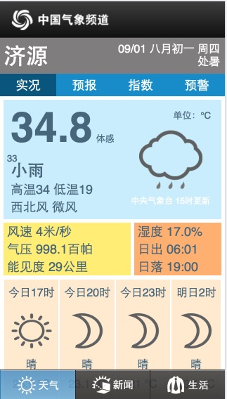

# Weather
### 抓取国内天气状况,自带天气图片～
##### 数据效果一览：



##### 数据抓取源：<a href="http://3g.tianqi.cn/" target="_blank" >中国气象频道</a>
##### 返回数据结构：
```javascript
{
	"weather": "07",/*天气类型代码*/
	"weatherDecoder": "小雨",/*天气类型*/
	"weatherPic": "images/weatherPng/d07.png",/*天气类型对应的图片，前面加上域名3g.tianqi.cn即可获取到图片，如：http://3g.tianqi.cn/images/weatherPng/d07.png*/
	"temperature": "34.8",/*当前温度*/
	"feelTemperature": "33",/*当前体感温度*/
	"windDir": "7",/*风向代码*/
	"windDirDecoder": "西北风",/*风向*/
	"windPower": "0",/*风力大小代码*/
	"windPowerDecoder": "微风",/*风力大小*/
	"windDirAngle": "320",/**/
	"windSpeed": "4",/*风速，4m/s*/
	"humidity": "19.0",/*湿度  单位：百分比*/
	"pressure": "998.5",/*气压  单位：百帕*/
	"visibility": "29",/*能见度   单位：公里*/
	"sunrise": "06:01",/*日出时间*/
	"sunset": "19:00",/*日落时间*/
	"lunar": "09/01 八月初一 周四"/*公历，农历，星期*/,
	"solarTerm": "处暑",/*节日*/
	"publicTime": "14",/*当前时段天气发布时间： 14点*/
	"threeTimea": "今日17时",/*以14点起算，三小时后天气预报时间  17点*/
	"threeWeatherPica": "images/weatherPng/d00.png",/*三小时后天气类型对应的图片*/
	"threeWeatherDecodera": "晴",/*三小时后天气类型*/
	"threeWeathera": "25.9",/*三小时后温度*/
	"threeTimeb": "今日20时",/*以14点起算，六小时后天气预报时间  20点*/
	"threeWeatherPicb": "images/weatherPng/n00.png",/*六小时后天气类型对应的图片*/
	"threeWeatherDecoderb": "晴",/*六小时后天气类型*/
	"threeWeatherb": "23.1",/*六小时后温度*/
	"threeTimec": "今日23时",
	"threeWeatherPicc": "images/weatherPng/n00.png",
	"threeWeatherDecoderc": "晴",
	"threeWeatherc": "21",
	"threeTimed": "明日2时",
	"threeWeatherPicd": "images/weatherPng/n00.png",
	"threeWeatherDecoderd": "晴",
	"threeWeatherd": "19.1",
	"beans": [],
	"tmax": "34",/*今日最大气温*/
	"tmin": "19"/*今日最小气温*/
}
```
##### 接口具体使用方法见:
[**测试用例**](https://github.com/bigmeow/Weather/blob/master/src/com/test/Test.java)
